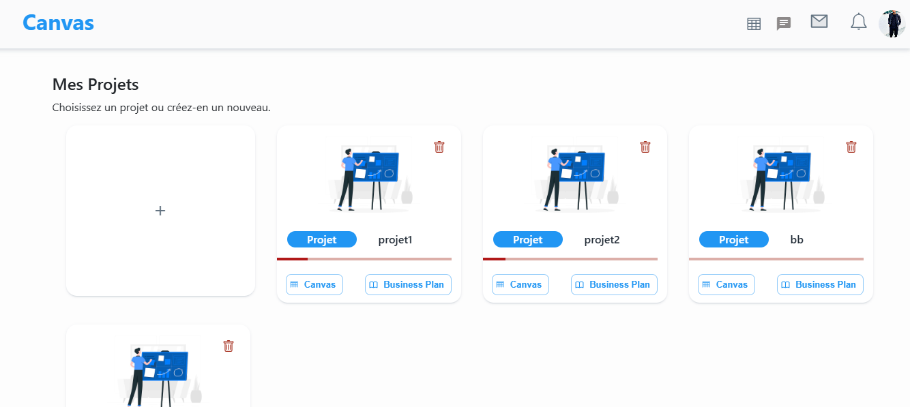
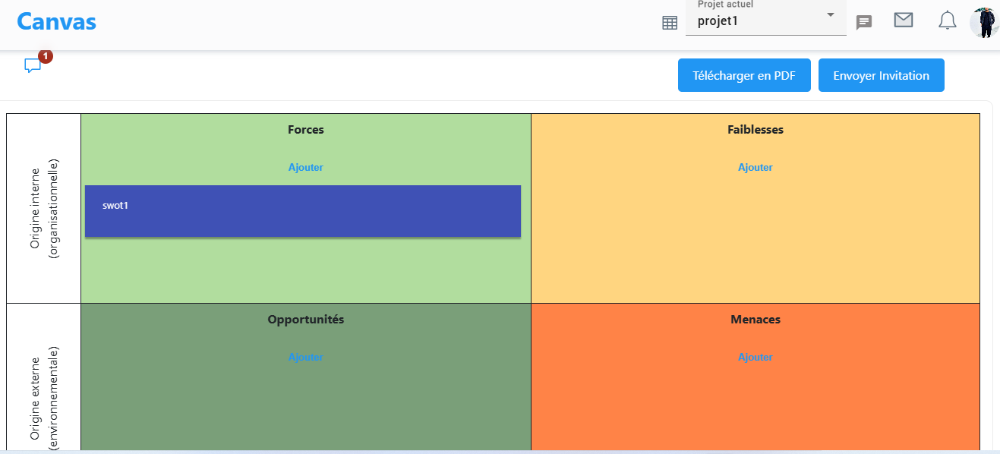

# Application NestJs and angular 16

## Features

- User Registration: Users can register for a new account.
- User Authentication: Existing users can log in to their accounts securely.
- Forget Password: Users can recover their password by requesting a recovery link sent via email.
- Email Activation Account: Accounts are activated using secure email validation.
- Creat Project: Allows the user to create a project with 6 predefined canvas.
- Invite User to Project: Allows the user to invite another user to view specific canvas within the project.
- **Auto Delete Inactive Users**: Automatically deletes users if their accounts are not activated within one week of registration.
- **Real-time Chat**: Users can engage in live conversations within the platform using WebSocket technology.

#### Page Login

#### Page Signup

#### Page Forget Password

#### Acctivation Email

#### Page Change Password

#### Page Creat Project

#### Canvas List Page

#### Bmc Canvas Page

#### Lean Canvas Page

#### VP Canvas Page

#### Swot Canvas Page

#### Empathy Map Canvas Page

#### Persona Canvas Page

## Technologies Used

### Backend (backEnd)

- NestJs
- JWT Token Authentication
- GitHub Actions
- scheduler
- Websocket
- MicroService
- Mysql

### Frontend (frontEnd)

- Angular
- Interceptor
- Component-Based Architecture
- Lazy Loading
- Authentication Guard
- OpenAPI Generator for Angular

## Contributors

- [Chouaibi Mohamed Aymen](https://github.com/aymen-1996)